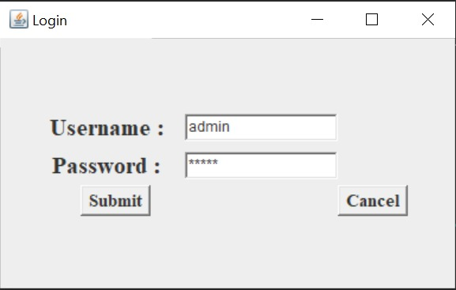
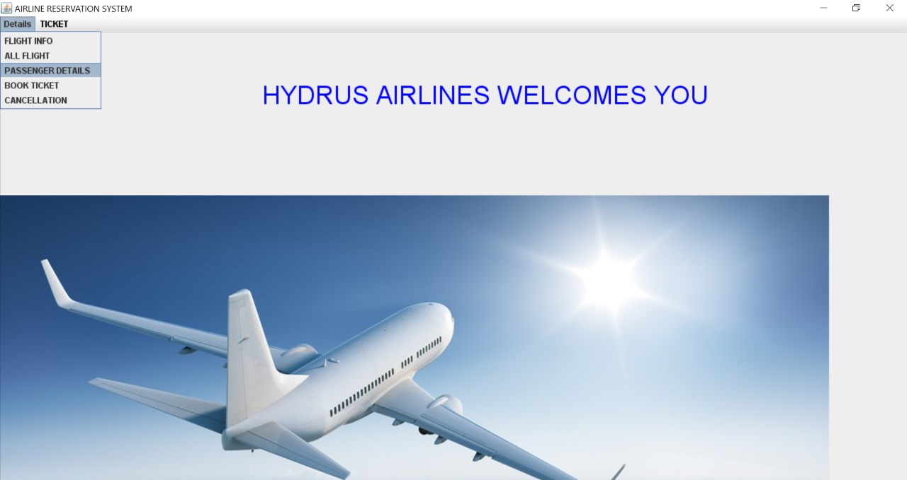
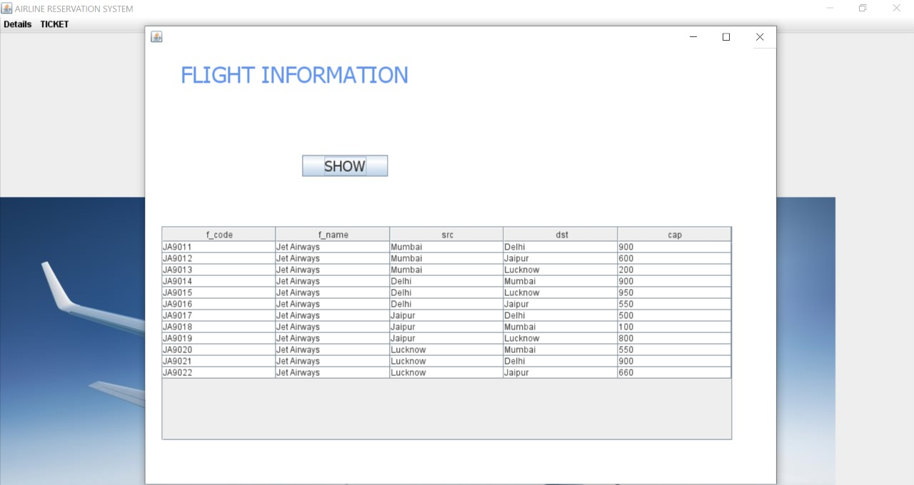
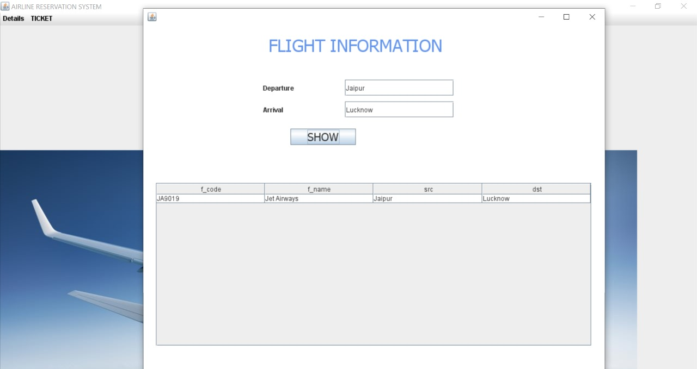
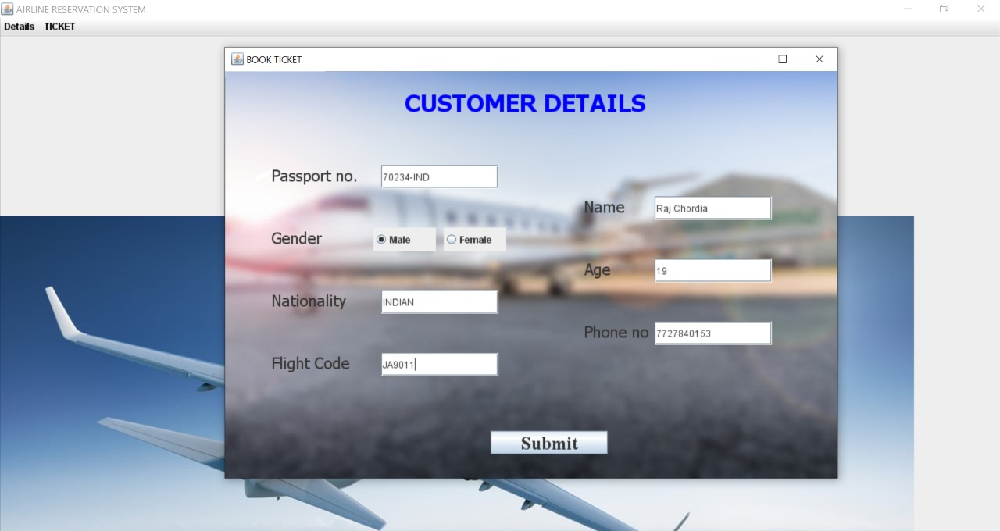
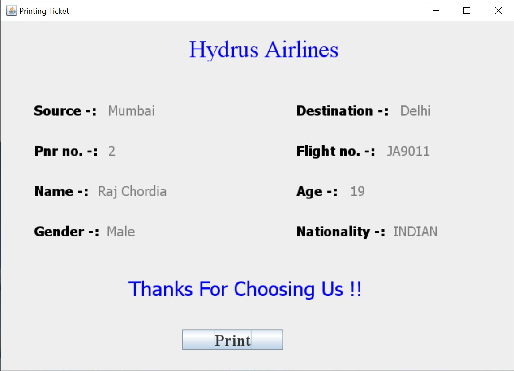
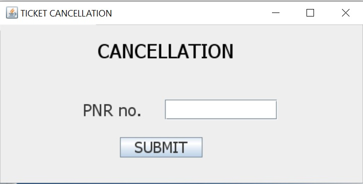

# The Hydrus Airlines

> Light Weight app build using java swing let's you search for a flight, book a ticket, cancel the ticket and print the ticket all at one place. 
> It's easy to use and fun to play around. Under the guidance of Mr. Mukesh Jadon and all the TA's at LNMIIT we have joyfully created the project.
> Using MySQL for storing data and Java Swing library which if fun to work with.

<h2>Features</h2>
<ul>
	<li><a href = "#login">Login</a></li>
	<li><a href = "#mainframe">Main Screen</a></li>
	<li><a href = "#flights">All Flights</a></li>
	<li><a href = "#flight">Between Destinations</a></li>
	<li><a href = "#book">Book Ticket</a></li>
	<li><a href = "#print">Print Ticket</a></li>
	<li><a href = "#cancel">Cancel Ticket</a></li>
</ul>

### Contributors

<table>
	<tr>
		<td>19UCS230 </td> <td>Divyansh Goyal </td>		
	</tr>
	<tr>
		<td>19UCS246 </td> <td> Gaurav Singh Chauhan </td>
	</tr>
	<tr>
		<td>19UCS257 </td> <td> Priyansh Bordia </td>
	</tr>
</table>

<h2 id="login">Login</h2>

<h2 id="mainframe">Main Screen</h2>

<h2 id="flights">All Flights</h2>

<h2 id="flight">Between Destinations</h2>

<h2 id="book">Book Ticket</h2>

<h2 id="print">Print Ticket</h2>

<h2 id="cancel">Cancel Booking</h2>

